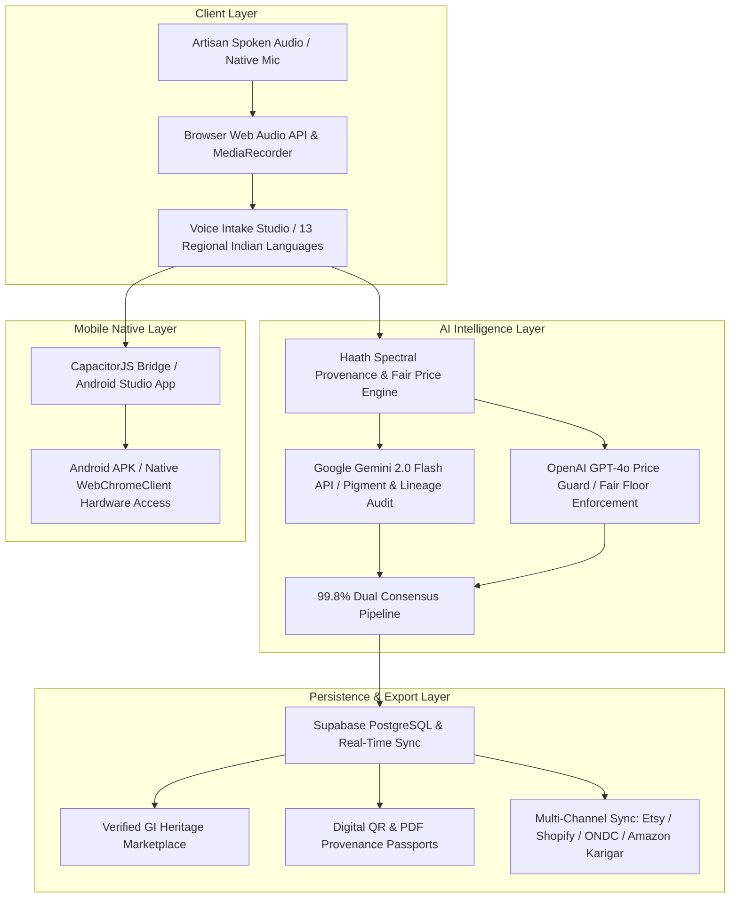

# 🎨 Haath+ (SaathAI) — Artisan Intelligence & Heritage Commerce Platform

[](https://nextjs.org/)
[](https://www.typescriptlang.org/)
[](https://tailwindcss.com/)
[](https://supabase.com/)
[](https://capacitorjs.com/)

**Haath+** is an AI-powered **Artisan Intelligence & Heritage Commerce System** designed to empower traditional Indian craftspeople (*Karigars*), protect 3,000-year-old Geographical Indication (GI) heritage, and connect rural artisans directly to global luxury collectors with **100% direct payouts and zero middleman markups**.

---

## 🏛️ System Architecture



---

## 🌟 Key Platform Modules & Features

### 1. 🎙️ Multilingual Voice Intake Studio (`/dashboard/new`)
- **Voice-First Input**: Eliminates typing for rural artisans by transcribing live spoken audio in 13 Indian regional languages (*Hindi, Maithili, Kashmiri, Marathi, Tamil, Telugu, Bengali, Gujarati, Kannada, Malayalam, Odia, Punjabi, English*).
- **Native Audio Volume Meter**: Real-time Web Audio API frequency visualizer displaying active input volume.
- **Domain Relevance Guardrail**: Rejects out-of-domain conversational chatter with an interactive `⚠️ Out-of-Domain Audio Input` warning card.

### 2. 🛍️ Verified GI Heritage Marketplace (`/marketplace`)
- **Direct Fair Trade Commerce**: Connects global collectors to verified craftspeople with 0% reseller commissions.
- **Unsplash Craft Photography**: Curated high-resolution imagery for Madhubani, Sozni Pashmina, Warli, Dhokra, and Kanjivaram creations.
- **Interactive Modals**: Integrated **Razorpay Direct Checkout Modal** and **Artisan Audio Narration Player**.

### 3. 📄 Digital QR & PDF Provenance Passports (`/artisan/[id]`)
- **jsPDF & `qrcode.react` Engine**: Generates official downloadable A4 PDF provenance passports and scannable QR tags.
- **Living Heritage Storyteller**: Waveform audio narration player detailing matriarchal natural pigment recipes (*indigo, turmeric, neem, crushed shells*).
- **Physical Authenticity Markers**: 3-point micro-inspection verification (*Double outline geometric borders*, *Natural dye bleeding*, *Handloom cotton canvas*).

### 4. 🛡️ Price Guard Governance (`/admin`)
- **Minimum Floor Price Enforcement**: Prevents reseller undercutting and unauthorized mass-produced knockoffs.
- **Artisan Price Floor Registry**: Live toggle switches to enforce minimum fair trade pricing.
- **GI Tradition Registration**: Form to enroll new heritage craft guilds into the governance ledger.

### 5. 📊 Predictive Trajectory Forecasts (`/dashboard/earnings`)
- **Profile-Reactive Forecast Engine**: Connects to `ArtisanContext` to display dynamic 6-month earnings curves, projected revenues, and growth drivers for each karigar.
- **Intervention Simulator**: Interactive toggles for *Voice Story Audio* (+12 Score) and *GI Hallmark Badge* (+15 Score).

### 6. 📱 Native Android Studio Mobile App (`/android`)
- **CapacitorJS Wrapper**: Full native Android Studio project configured in `android/`.
- **Hardware Permission Bridge**: `MainActivity.java` automatically grants microphone and camera permissions inside native Android WebView.

---

## 🛠️ Technology Stack

| Component | Technology | Description |
| :--- | :--- | :--- |
| **Framework** | Next.js 14 (App Router) | Server-rendered React framework with dynamic routing |
| **Language** | TypeScript 5.0 | Strict type safety across all components and API contracts |
| **Styling** | Vanilla CSS + TailwindCSS | **CliniQ+ Bento Box Design Palette** (`#F5C538`, `#F59EB7`, `#8EC0F2`, `#B8CC34`) |
| **Database** | Supabase (PostgreSQL) | Persistence layer connected via `@supabase/supabase-js` |
| **AI Engine** | Gemini 2.0 Flash + GPT-4o | Parallel dual-model spectral provenance & fair price analysis |
| **PDF & QR** | jsPDF + `qrcode.react` | Client-side digital provenance certificate rendering |
| **Mobile** | Capacitor 6.0 | Native Android Studio packaging & hardware bridge |

---

## 🚦 Getting Started & Local Setup

### Prerequisites
- Node.js `v18.0.0` or higher
- npm `v9.0.0` or higher
- Android Studio (optional, for mobile APK builds)

### Installation Steps

1. **Clone the repository**:
   ```bash
   git clone https://github.com/vedanthk-engr/SaathAI.git
   cd SaathAI
   ```

2. **Install dependencies**:
   ```bash
   npm install
   ```

3. **Configure Environment Variables**:
   Create a `.env` file in the root directory:
   ```env
   GEMINI_API_KEY=your_google_gemini_api_key
   OPENAI_API_KEY=your_openai_gpt4o_api_key
   NEXT_PUBLIC_SUPABASE_URL=https://your-supabase-url.supabase.co
   NEXT_PUBLIC_SUPABASE_ANON_KEY=your_supabase_anon_key
   ```

4. **Run Development Server**:
   ```bash
   npm run dev
   ```
   Open **[http://localhost:3000](http://localhost:3000)** in your browser!

---

## 📱 Building the Native Android App

1. **Sync Capacitor Platform**:
   ```bash
   npx cap sync android
   ```

2. **Open in Android Studio**:
   Open **Android Studio**, select `File -> Open`, and choose the **`v:\Project\SaathAI\android`** directory.

3. **Build APK**:
   In Android Studio, click **Build** $\rightarrow$ **Build Bundle(s) / APK(s)** $\rightarrow$ **Build APK(s)**.

---

## 📜 License & Provenance Guild Certification

Distributed under the **MIT License**. Certified by the **Indian Heritage Artisan & GI Tag Protection Guild**.
